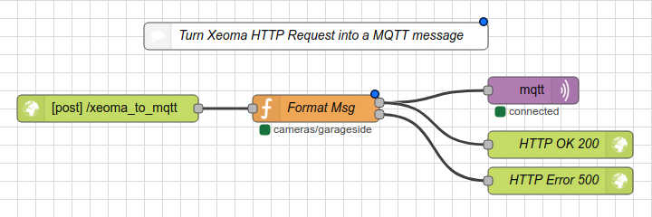

# docker-xeoma

Deprecated, see below.

This is a docker container that runs a webserver that is used to publish MQTT messages. This is so Xeoma's HTTP Request Sender module can be used to send MQTT events that can later be intercepted by something like [Home Assistant](https://home-assistant.io/). The idea in the future is to add support for MQTT messages coming back to Xeoma via the HTTP Switch module in the future. Pull Requests are welcome!

This docker image is available [on Docker Hub](https://hub.docker.com/r/skylord123/xeoma-mqtt).

## ------> DEPRECATED: BETTER TOOL INSTEAD <--------

This project is no longer being maintained. I suggest using [Node-RED](https://nodered.org/) instead. You can wire lots of different things together with Node-RED compared to the single task this container accomplished. I also never added support for auth (as well as some other updates I wanted to do) that come supported out of the box in Node-RED. You can also wire up Xeoma to fire basically to anything (not just MQTT) so you could for example take a snapshot from your camera if motion is detected and then email that to your account. The possibilities are endless.

If you do decide to use Node-RED here is the snippet I use:

```
[{"id":"c23bb9c9.d6c358","type":"http in","z":"ff717302.0c688","name":"","url":"/xeoma_to_mqtt","method":"post","upload":false,"swaggerDoc":"","x":360,"y":1380,"wires":[["976d6b19.5b14b8"]]},{"id":"4bfdb53e.76e1bc","type":"http response","z":"ff717302.0c688","name":"HTTP OK 200","statusCode":"200","headers":{},"x":860,"y":1420,"wires":[]},{"id":"dd5bd9c2.ef3c48","type":"mqtt out","z":"ff717302.0c688","name":"","topic":"","qos":"2","retain":"true","broker":"5a59e251.9e1d4c","x":830,"y":1360,"wires":[]},{"id":"976d6b19.5b14b8","type":"function","z":"ff717302.0c688","name":"Format Msg","func":"// snippet from https://github.com/skylord123/xeoma-mqtt\n\nvar ch_prefix = 'cameras/';\nmsg.topic = (typeof msg.req.body.channel !== 'undefined' ? ch_prefix + msg.req.body.channel : null);\nmsg.payload = (typeof msg.req.body.msg !== 'undefined' ? msg.req.body.msg : null);\n\nif(!msg.topic || !msg.payload) {\n    return [null, msg];\n}\n\nnode.status({\n    fill: msg.payload == \"1\" ? \"green\" : \"red\",\n    shape: \"dot\",\n    text: msg.topic\n});\n\nreturn [msg, null];","outputs":2,"noerr":0,"x":590,"y":1380,"wires":[["dd5bd9c2.ef3c48","4bfdb53e.76e1bc"],["2cc21314.ddaaec"]]},{"id":"2cc21314.ddaaec","type":"http response","z":"ff717302.0c688","name":"HTTP Error 500","statusCode":"500","headers":{},"x":860,"y":1460,"wires":[]},{"id":"cf1132aa.b3117","type":"comment","z":"ff717302.0c688","name":"Turn Xeoma HTTP Request into a MQTT message","info":"Snippet from https://github.com/skylord123/xeoma-mqtt","x":590,"y":1300,"wires":[]},{"id":"5a59e251.9e1d4c","type":"mqtt-broker","z":"","name":"","broker":"192.168.1.10","port":"1883","clientid":"","usetls":false,"compatmode":true,"keepalive":"60","cleansession":true,"birthTopic":"","birthQos":"0","birthPayload":"","willTopic":"","willQos":"0","willPayload":""}]
```
NODE-RED:

Import the above snippet and then modify the variables in the function block and MQTT block to match what channel prefix you want to use.

Xeoma:

All you do is create two HTTP Request Senders: One will send a message at the start and then the other will send one when event ends. Each will have a different payload such as 1 and 0 or true and false. Change each value between the < and > below to get this to work. If you were using the python script then updating to this format should be pretty straightforward.
```
http://<user>:<pass>@<NODE-RED-HOST>:<NODE-RED-PORT>/xeoma_to_mqtt?channel=<CHANNELNAME>&msg=<msg-payload>
```


## Running

To launch the container:

`docker run -d --name=Xeoma -p 5000:5000 -v /local/path/to/config:/config skylord123/xeoma-mqtt`

When run for the first time, a file named config.ini will be created in the config dir, and the container will exit. Edit this file, and once complete, change `configured` to `True` and start (or restart) the container.

View logs using:

`docker logs xeoma-mqtt`

## Usage

This container runs a python web server that listens on port `5000` by default. You can test that messages are being posted by using this URL:
`http://127.0.0.1:5000/xeoma_data_handle/<channel>/<msg>`
example:
`http://127.0.0.1:5000/xeoma_data_handle/frontyard_camera/1`

To send an MQTT message from Xeoma when motion is detected just add a HTTP Request Sender module chained after the Motion module. Set the "Host name or IP Address" to `<host>/xeoma_data_handle/<channel>/<msg>` and "Port" to `5000` and make sure that the "Send" dropdown has "when event started" selected. You can optionally set the "Sending interval" (you will have to test what works best for you).

If you want to detect when the event ended as well you will have to create the same module side-by-side but change the `<msg>` in the path as well as the "Send" dropdown to "when event ended".

## Issues

There is currently an issue with the authentication. Just leave blank for now.

### Support

If you find any bugs with the software that are related to the docker container, let me know on GitHub with and Issue. If you find bugs that are related to the actual software or cameras, etc then contact FelenaSoft.

## Credits

Thanks to [Coppit](https://github.com/coppit) for creating an awesome [Xeoma container](https://github.com/coppit/docker-xeoma) (and for giving me a readme I could base mine off)
